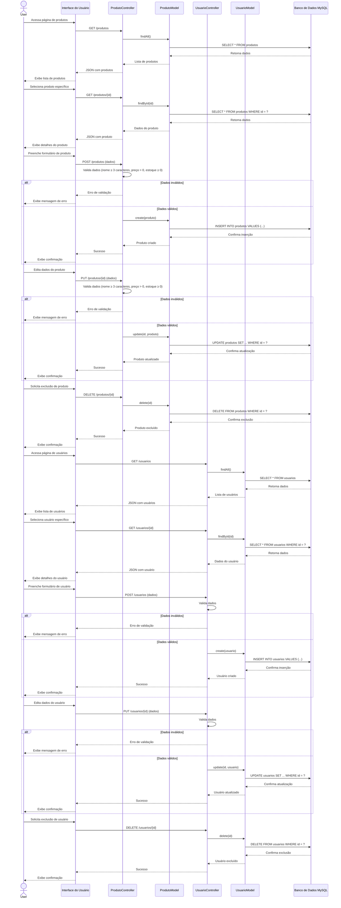

```mermaid
sequenceDiagram
    actor User
    participant UI as Interface do Usuário
    participant PC as ProdutoController
    participant PM as ProdutoModel
    participant UC as UsuarioController
    participant UM as UsuarioModel
    participant DB as Banco de Dados MySQL

    %% Cenário 1: Listar todos os produtos
    User->>UI: Acessa página de produtos
    UI->>PC: GET /produtos
    PC->>PM: findAll()
    PM->>DB: SELECT * FROM produtos
    DB-->>PM: Retorna dados
    PM-->>PC: Lista de produtos
    PC-->>UI: JSON com produtos
    UI-->>User: Exibe lista de produtos

    %% Cenário 2: Obter produto específico
    User->>UI: Seleciona produto específico
    UI->>PC: GET /produtos/{id}
    PC->>PM: findById(id)
    PM->>DB: SELECT * FROM produtos WHERE id = ?
    DB-->>PM: Retorna dados
    PM-->>PC: Dados do produto
    PC-->>UI: JSON com produto
    UI-->>User: Exibe detalhes do produto

    %% Cenário 3: Criar novo produto
    User->>UI: Preenche formulário de produto
    UI->>PC: POST /produtos (dados)
    PC->>PC: Valida dados (nome ≥ 3 caracteres, preço > 0, estoque ≥ 0)
    alt Dados inválidos
        PC-->>UI: Erro de validação
        UI-->>User: Exibe mensagem de erro
    else Dados válidos
        PC->>PM: create(produto)
        PM->>DB: INSERT INTO produtos VALUES (...)
        DB-->>PM: Confirma inserção
        PM-->>PC: Produto criado
        PC-->>UI: Sucesso
        UI-->>User: Exibe confirmação
    end

    %% Cenário 4: Atualizar produto
    User->>UI: Edita dados do produto
    UI->>PC: PUT /produtos/{id} (dados)
    PC->>PC: Valida dados (nome ≥ 3 caracteres, preço > 0, estoque ≥ 0)
    alt Dados inválidos
        PC-->>UI: Erro de validação
        UI-->>User: Exibe mensagem de erro
    else Dados válidos
        PC->>PM: update(id, produto)
        PM->>DB: UPDATE produtos SET ... WHERE id = ?
        DB-->>PM: Confirma atualização
        PM-->>PC: Produto atualizado
        PC-->>UI: Sucesso
        UI-->>User: Exibe confirmação
    end

    %% Cenário 5: Excluir produto
    User->>UI: Solicita exclusão de produto
    UI->>PC: DELETE /produtos/{id}
    PC->>PM: delete(id)
    PM->>DB: DELETE FROM produtos WHERE id = ?
    DB-->>PM: Confirma exclusão
    PM-->>PC: Produto excluído
    PC-->>UI: Sucesso
    UI-->>User: Exibe confirmação

    %% Cenário 6: Listar todos os usuários
    User->>UI: Acessa página de usuários
    UI->>UC: GET /usuarios
    UC->>UM: findAll()
    UM->>DB: SELECT * FROM usuarios
    DB-->>UM: Retorna dados
    UM-->>UC: Lista de usuários
    UC-->>UI: JSON com usuários
    UI-->>User: Exibe lista de usuários

    %% Cenário 7: Obter usuário específico
    User->>UI: Seleciona usuário específico
    UI->>UC: GET /usuarios/{id}
    UC->>UM: findById(id)
    UM->>DB: SELECT * FROM usuarios WHERE id = ?
    DB-->>UM: Retorna dados
    UM-->>UC: Dados do usuário
    UC-->>UI: JSON com usuário
    UI-->>User: Exibe detalhes do usuário

    %% Cenário 8: Criar novo usuário
    User->>UI: Preenche formulário de usuário
    UI->>UC: POST /usuarios (dados)
    UC->>UC: Valida dados
    alt Dados inválidos
        UC-->>UI: Erro de validação
        UI-->>User: Exibe mensagem de erro
    else Dados válidos
        UC->>UM: create(usuario)
        UM->>DB: INSERT INTO usuarios VALUES (...)
        DB-->>UM: Confirma inserção
        UM-->>UC: Usuário criado
        UC-->>UI: Sucesso
        UI-->>User: Exibe confirmação
    end

    %% Cenário 9: Atualizar usuário
    User->>UI: Edita dados do usuário
    UI->>UC: PUT /usuarios/{id} (dados)
    UC->>UC: Valida dados
    alt Dados inválidos
        UC-->>UI: Erro de validação
        UI-->>User: Exibe mensagem de erro
    else Dados válidos
        UC->>UM: update(id, usuario)
        UM->>DB: UPDATE usuarios SET ... WHERE id = ?
        DB-->>UM: Confirma atualização
        UM-->>UC: Usuário atualizado
        UC-->>UI: Sucesso
        UI-->>User: Exibe confirmação
    end

    %% Cenário 10: Excluir usuário
    User->>UI: Solicita exclusão de usuário
    UI->>UC: DELETE /usuarios/{id}
    UC->>UM: delete(id)
    UM->>DB: DELETE FROM usuarios WHERE id = ?
    DB-->>UM: Confirma exclusão
    UM-->>UC: Usuário excluído
    UC-->>UI: Sucesso
    UI-->>User: Exibe confirmação
```

# CADASTRO DE PRODUTO
* ID
* NOME
* PREÇO
* ESTOQUE
* DESCRIÇÃO

# CADASTRO DE USUÁRIO
* NOME
* EMAIL
* SENHA
* CARGO

POSTMAN